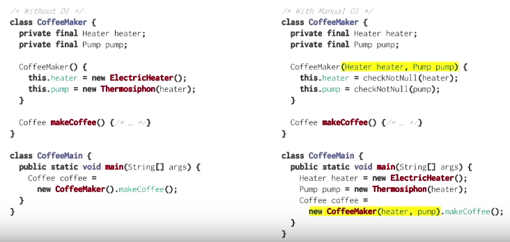
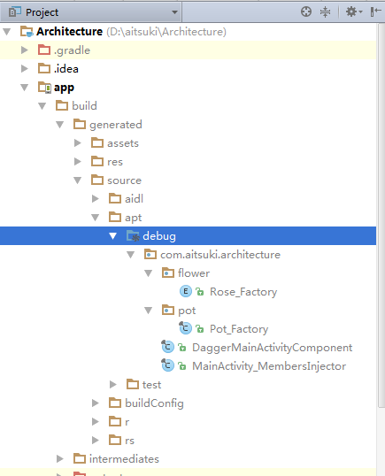

### 整理自
 - http://blog.zhaiyifan.cn/2016/03/27/android-new-project-from-0-p4/
 - http://www.jianshu.com/p/24af4c102f62 写得多但是真不适合初学者看
 - http://www.cnblogs.com/tiantianbyconan/p/5092525.html 提出“依赖图表”的概念，一下子就清晰了
# Daggar2
#### 历史
Square公司 Dagger
Google继承Dagger 做Dagger2
#### 同类产品
 - Guide
 - 和基于Guide 的RoboGuide
先于Dagger2，与Dagger的出生顺序不详
#### Origin（权当兴趣才看，建议不要看）
Dagger2，起源于Square的Dagger，是一个完全在编译期间进行的依赖注入框架，完全去除了反射。

关于Dagger2的最初想法，来自于2013年12月的Proposal: Dagger 2.0，Jake大神在issue里面也有回复哦，而idea的来源者Gregory Kick的GitHub个人主页也没多少follower，自己也没几个项目，主要都在贡献其他的repository，可见海外重复造轮子的风气比我们这儿好多了。

扯远了，Dagger2的诞生就是源于开发者们对Dagger1半静态化半运行时的不满（尤其是在服务端的大型应用上），想要改造成完整的静态依赖图生成，完全的代码生成式依赖注入解决方案。在权衡了什么对Android更适合，以及对大型应用来说什么更有意义（往往有可怕数量的注入）两者后，Dagger2诞生了。
#### Dagger2的优点
 - 与Spring比较：前面已经提到了(Origin段落)它是在编译期间进行的依赖注入。而Spring是在运行时验证配置和依赖图的。

 - 与Guice比较：Guice虽然较Spring进了一步，干掉了xml，通过Java声明依赖注入比起Spring好找多了，但其跟踪和报错（运行时的图验证）实在令人抓狂，而且在不同环境注入不同实例的配置也挺恶心的（if else各种判断），感兴趣的可以去看看，项目就在GitHub上，Android版本的叫RoboGuice。
 - 与Dagger1（Dagger）比较：而Dagger2和Dagger1的差别在上节已经提到了，更专注于开发者的体验，从半静态变为完全静态，从Map式的API变成申明式API（@Module），生成的代码更优雅，更高的性能（跟手写一样），更简单的debug跟踪，所有的报错也都是在编译时发生的。
#### Dagger2的缺点
 - 丧失动态性（待举例）
 - 没法自动升级：从Dagger1到Dagger2
#### 性能
如果对性能感兴趣的话，可以去看看Comparing the Performance of Dependency Injection Libraries（http://blog.nimbledroid.com/2016/03/07/performance-of-dependency-injection-libraries.html），RoboGuice:Dagger1:Dagger2差不多是50:2:1的一个性能差距。
### why依赖注入
http://blog.zhaiyifan.cn/images/android-new-project-from-0-dagger-di.png
类依赖对象，持有对象实例比
类依赖对象，但不持有对象实例更糟糕
因为你不能改变（替换）被依赖对象的实例。

类应该持有对象的引用。然后提供方法把被依赖对象注入（传递）进去
### why Dagger2（Dagger2使用场景）

生动点来说的话。有一场派对：
 - Android开发A说，有妹子我才来。
 - 美女前端B说，有帅哥设计师，我才来。
 - iOS开发C说，有Android开发，我才来。
 - 帅哥设计师说，只有礼拜天我才有空。
```
class AndroidDeveloper extends PartyMember {
    public AndroidDeveloper(PartyMember female) throws NotMeizhiSayBB;
}

public class FrontEndDeveloper extends PartyMember {
    public FrontEndDeveloper(Designer designer) throws NotHandsomeBoySayBB;
}

class IOSDeveloper extends PartyMember {
    public IOSDeveloper(AndroidDeveloper dev);
}

class Designer extends PartyMember {
    public Designer(Date date) throw CannotComeException;
}

class PartyMember {
    private int mSex = 0; // 1 for male, 2 for female.
    public void setSex(int sex);
}

// 手动DI，要自己想怎么设计顺序，还不能轻易改动
Designer designer = new Designer("礼拜天")；
FrontEndDeveloper dev1 = new FrontEndDeveloper(designer);
dev1.setSex(2);
AndroidDeveloper dev2 = new AndroidDeveloper(dev1);
IOSDeveloper dev3 = new IOSDeveloper(dev2);

// With Dagger2
@Inject
Designer designer;
@Inject
FrontEndDeveloper dev1;
@Inject
AndroidDeveloper dev2;
@Inject
IOSDeveloper dev3;

// 不使用DI太可怕了...自己想象一下会是什么样吧
...我懒
```
### 集成
#### 配置module的build.gradle
```
apply plugin: 'com.neenbedankt.android-apt'
 
buildscript {
  repositories {
    jcenter()
  }
  dependencies {
    classpath 'com.neenbedankt.gradle.plugins:android-apt:1.4'
  }
}
 
android {
  ...
}
 
dependencies {
  apt 'com.google.dagger:dagger-compiler:2.0'
  compile 'com.google.dagger:dagger:2.0'
  compile 'org.glassfish:javax.annotation:10.0-b28'
  ...
}
```

-------------------------------从依赖图例子后面就没看了-------------------------------
-------------------------------讲的是思路不是操作方法-------------------------------


### 整理自 http://www.jianshu.com/p/24af4c102f62

#### Q&A
 - Q1：dagger2是什么，有什么用？
 - A1：dagger2是一个基于JSR-330标准的依赖注入框架，在编译期间自动生成代码，负责依赖对象的创建。

 - Q2：什么是JSR-330
 - A2：JSR即Java Specification Requests，意思是java规范提要。
而JSR-330则是 Java依赖注入标准
关于JSR-330可以阅读这篇文章Java 依赖注入标准（JSR-330）简介，随便看下就好了，不是重点。

#### 一个Demo
三、@Inject和@Component

先来看一段没有使用dagger的依赖注入Demo
MainActivity依赖Pot， Pot依赖Rose
```
public class Rose {
    public String whisper()  {
        return "热恋";
    }
}
public class Pot {

    private Rose rose;

    @Inject
    public Pot(Rose rose) {
        this.rose = rose;
    }

    public String show() {
        return rose.whisper();
    }
}
public class MainActivity extends AppCompatActivity {

    private Pot pot;

    protected void onCreate(@Nullable Bundle savedInstanceState) {
        super.onCreate(savedInstanceState);

        Rose rose = new Rose();
        pot = new Pot(rose);

        String show = pot.show();
        Toast.makeText(MainActivity.this, show, Toast.LENGTH_SHORT).show();
    }
}
```
使用Dagger2进行依赖注入如下：
```
public class Rose {

    @Inject
    public Rose() {}

    public String whisper()  {
        return "热恋";
    }
}
public class Pot {

    private Rose rose;

    @Inject
    public Pot(Rose rose) {
        this.rose = rose;
    }

    public String show() {
        return rose.whisper();
    }
}
@Component
public interface MainActivityComponent {
    void inject(MainActivity activity);
}
public class MainActivity extends AppCompatActivity {

    @Inject
    Pot pot;

    protected void onCreate(@Nullable Bundle savedInstanceState) {
        super.onCreate(savedInstanceState);

        // 这个类是重新编译后Dagger2自动生成的，所以写这行代码之前要先编译一次
        // Build --> Rebuild Project
        DaggerMainActivityComponent.create().inject(this);
        String show = pot.show();
        Toast.makeText(MainActivity.this, show, Toast.LENGTH_SHORT).show();
    }
}
```
Dagger2生成的代码保存在这里：




#### 注解说明
##### @Component

@Inject注解只是JSR-330中定义的注解，在javax.inject包中。
这个注解本身并没有作用，它需要依赖于注入框架才具有意义，用来标记需要被注入框架注入的方法，属性，构造。

而Dagger2则是用Component来完成依赖注入的，@Component可以说是Dagger2中最重要的一个注解。
```
@Component
public interface MainActivityComponent {
    void inject(MainActivity activity);
}
```
以上是定义一个Component的方式。使用接口定义，并且@Component注解。
命名方式推荐为：目标类名+Component，在编译后Dagger2就会为我们生成DaggerXXXComponent这个类，它是我们定义的xxxComponent的实现，在目标类中使用它就可以实现依赖注入了。
