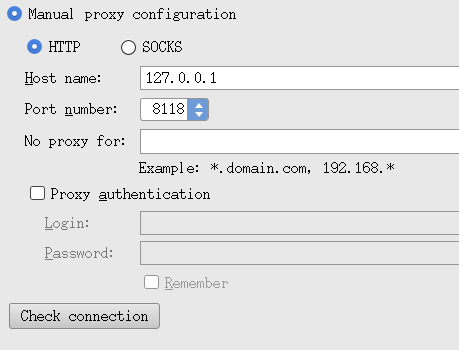
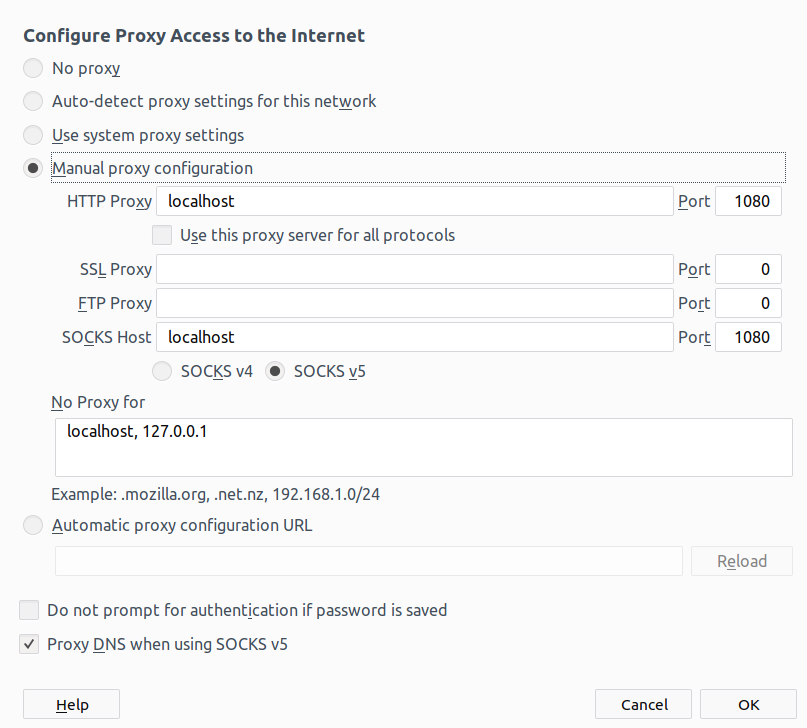

### 浏览器

[HERE](http://dcamero.azurewebsites.net/shadowsocksr.html#linux)

```sudo apt-get install git python-m2crypto libsodium18```

```cd ~/Downloads```

```git clone -b manyuser https://github.com/shadowsocksrr/shadowsocksr.git```


- startShadowsocks.sh
```
cd ~/Downloads/shadowsocksr/shadowsocks/
sudo python local.py -c /etc/shadowsocks.json -d start
echo "OK"
```
 - stopShadowsocks.sh
 
```
cd ~/Downloads/shadowsocksr/shadowsocks/
sudo python local.py -c /etc/shadowsocks.json -d stop
```

 - /etc/shadowsocks.json
```
{
"server":"4*.3*.1**.2*2",
"server_ipv6":"::",
"server_port":80,
"local_address":"127.0.0.1",
"local_port":1080,
"password":"****",
"timeout":300,
"udp_timeout":60,
"method":"chacha20-ietf",
"protocol":"auth_sha1_v4",
"protocol_param":"",
"obfs":"http_simple",
"obfs_param":"",
"fast_open":false,
"workers":1
}
```

### [终端](https://samzong.me/2017/11/17/howto-use-ssr-on-linux-terminal/)

apt install -y privoxy

```
# 添加本地ssr服务到配置文件
echo 'forward-socks5 / 127.0.0.1:1080 .' >> /etc/privoxy/config
# Privoxy 默认监听端口是是8118
export http_proxy=http://127.0.0.1:8118
export https_proxy=http://127.0.0.1:8118
export no_proxy=localhost
# 启动服务
systemctl start privoxy.service
```

```
# 访问各大网站，如果都有网页源码输出说明代理没问题
curl -sL www.baidu.com
curl -sL www.google.com
curl -sL www.google.com.hk
curl -sL www.google.co.jp
curl -sL www.youtube.com
curl -sL mail.google.com
curl -sL facebook.com
curl -sL twitter.com
curl -sL www.wikipedia.org
```

### 在 Android Studio 中的设置




### 在Firefox中的设置


